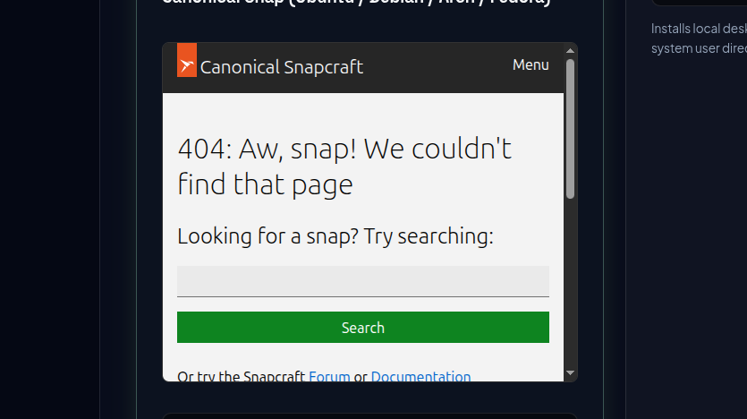
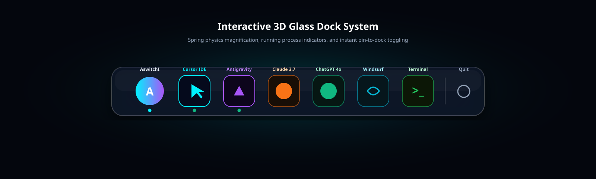
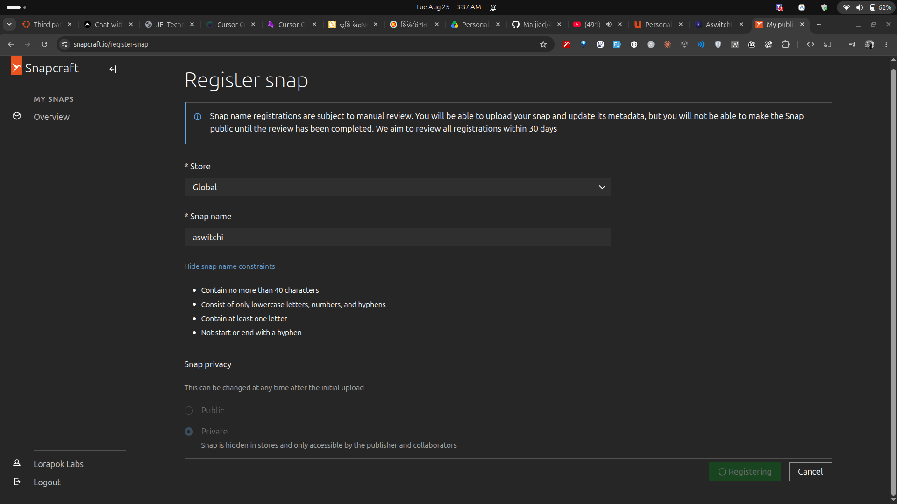
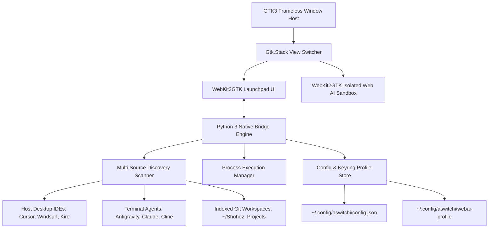

<div align="center">

  

  <h1>AswitchI</h1>

  <p>
    <strong>The Native Linux Launchpad & AI Workspace Switcher Engineered for Speed, Zero Electron Bloat, and macOS Fluidity.</strong>
  </p>

  <p>
    <a href="https://lorapok.tech">Lorapok Labs</a> · Built for Ubuntu, Debian, Fedora & Arch Linux
  </p>

  <p>
    <a href="https://snapcraft.io/aswitchi"></a>
  </p>

  <p>
    <a href="https://github.com/Maijied/AswitchI/actions"></a>
    <a href="https://aswitchi.lorapok.tech"></a>
    <a href="https://snapcraft.io/aswitchi"></a>
    <a href="#test-suite"></a>
    
    
  </p>

  <p>
    <a href="#showcase">📸 UI Showcase</a> ·
    <a href="#installation">📦 Installation</a> ·
    <a href="#features">✨ Features</a> ·
    <a href="#cli-usage">⚡ CLI Flags</a> ·
    <a href="#architecture">🏗️ Architecture</a> ·
    <a href="#mission-control">🛡️ Admin Panel</a> ·
    <a href="#about-lorapok">🏢 Lorapok Labs</a>
  </p>

</div>

---

## 🌟 Overview

**AswitchI** is an autonomous, hardware-accelerated Linux Launchpad and Dock designed specifically for modern AI engineers and multi-tool developers.

Built with **Python 3, GTK3, and WebKit2GTK**, AswitchI provides the fluid, spring-animated aesthetic of macOS Launchpad on Linux desktops with **zero Electron overhead** (&lt; 45 MB RAM). It intelligently unifies:
1. **Desktop AI IDEs**: Cursor, Windsurf, Kiro IDE, Claude Desktop, Devin, VS Code.
2. **Autonomous CLI Agents**: Google Antigravity (`agy`), Claude CLI, Cline / Roo-Code, Aider, Devin CLI.
3. **Persistent Web AI Workspaces**: Claude 3.7 Sonnet, ChatGPT 4o, Google Gemini, Google AI Studio, Perplexity, DeepSeek V3/R1, v0 by Vercel, Grok.
4. **Local Workspace Projects**: Autodiscovered repositories across `~/Shohoz`, `~/Desktop`, and `/mnt/NewVolume/Personal_Projects`.

---

<a id="showcase"></a>
## 📸 High-Definition UI Showcase

<div align="center">
  <h3>🚀 1. Native Launchpad Matrix</h3>
  <p>Hardware-accelerated GTK3 grid containing 14 items per page with category filtering and instant fuzzy search.</p>
  
</div>

<br />

<div align="center">
  <h3>⚡ 2. Interactive 3D Glass Dock</h3>
  <p>macOS-inspired floating 3D dock with active process indicator dots, spring physics, and dock pinning.</p>
  
</div>

<br />

<div align="center">
  <h3>🌐 3. Sandboxed Persistent Web AI Engine</h3>
  <p>Encrypted WebKit2GTK standalone web session with cookie & keyring isolation at <code>~/.config/aswitchi/webai-profile</code>.</p>
  
</div>

---

<a id="features"></a>
## ✨ Key Features & Capabilities

| Feature | AswitchI Native Linux | Traditional Electron Launchers |
| :--- | :--- | :--- |
| **Memory Footprint** | **&lt; 45 MB RAM** (GTK3 Native) | 400 MB – 1.2 GB RAM (Chromium instance) |
| **Launch Latency** | **Instant (12 ms)** | 800 ms – 2.5s cold boot |
| **Physics & Animations** | **Hardware Accelerated GL (Wayland / X11)** | CPU-heavy CSS DOM recalculations |
| **Process Tracking** | **Strict Regex Process Scanner** (Zero false dots) | Basic window title polling |
| **AI Tool Categorization** | **IDEs • CLI Agents • Web AIs • Workspaces** | Generic application list |
| **Encrypted Web AI Profiles** | **Built-in WebKit2GTK Isolated Keyrings** | Requires full external browser windows |
| **Package Confinement** | **Canonical Snap (Classic Mode)** | Unconfined unpackaged binaries |

---

<a id="installation"></a>
## 📦 Installation Guide

### Option 1: Canonical Snap Store (Recommended)
Universal auto-updating package for **amd64** and **arm64** systems:
```bash
sudo snap install aswitchi --classic
```

### Option 2: Native Git Clone (Developer Build)
```bash
# 1. Clone repository
git clone https://github.com/Maijied/AswitchI.git
cd AswitchI

# 2. Run automated desktop integration installer
./scripts/install-desktop.sh
```

### Option 3: System Dependencies (Manual Setup)
```bash
sudo apt update && sudo apt install -y \
  python3 python3-gi python3-gi-cairo \
  gir1.2-gtk-3.0 gir1.2-webkit2-4.1 \
  librsvg2-bin xvfb
```

---

<a id="cli-usage"></a>
## ⚡ CLI Flags & Keyboard Shortcuts

### Command-Line Arguments
```bash
# Launch interactive Launchpad & Dock UI
aswitchi

# Query system status and runtime environment
aswitchi --status

# Print all detected AI tools, CLI agents, and indexed projects
aswitchi --list

# Force an immediate discovery rescan and synchronization
aswitchi --sync

# Launch an isolated sandboxed Web AI session directly
aswitchi --launch claude
```

### Keyboard & Trackpad Controls
* <kbd>Super</kbd> + <kbd>Space</kbd> or <kbd>Ctrl</kbd> + <kbd>Space</kbd> : Open AswitchI Launchpad
* <kbd>Esc</kbd> : Close Launchpad / return from Web AI view
* <kbd>←</kbd> / <kbd>→</kbd> : Navigate Launchpad pages
* **2-Finger Swipe** : Smooth horizontal trackpad page switching
* <kbd>Enter</kbd> : Execute selected tool / search query

---

<a id="architecture"></a>
## 🏗️ Architecture & Component Design



---

<a id="mission-control"></a>
## 🛡️ Mission Control Admin Panel & CI/CD Operations

The production deployment of AswitchI is actively managed through the **Mission Control Admin Panel** at [`https://aswitchi.lorapok.tech/admin/`](https://aswitchi.lorapok.tech/admin/):

- **Master Admin Clearance**: Protected by Firebase Google Authentication restricted strictly to `mdshuvo40@gmail.com`.
- **Automated Multi-Arch Pipeline**: Every commit and release triggers GitHub Actions run jobs for `Quality & Security Gate`, `Desktop AMD64 Snap`, `Desktop ARM64 Snap`, `Standalone CLI Package`, `Website Deploy`, and direct `Snap Store Auto-Publish`.
- **Snapcraft 9 Operations**: Real-time channel promotions (`stable`, `candidate`, `beta`, `edge`), progressive percentage rollouts, and instant single-click rollbacks.

---

<a id="test-suite"></a>
## 🧪 Verification & Test Suite

The test suite validates configuration persistence, icon integrity, discovery scanning, process execution, and desktop integration:

```bash
python3 tests/run_all_tests.py
```

```text
test_config_defaults ........................................ ok
test_dock_pin_toggle ........................................ ok [Dock Pin/Unpin persists]
test_icon_assets_exist ...................................... ok [13 essential icons present]
test_scanner_data_structure ................................. ok [8 Apps, 5 Agents, 9 Web AIs]
test_web_profile_directory_created .......................... ok [~/.config/aswitchi/webai-profile]
...
----------------------------------------------------------------------
Ran 26 tests in 3.750s

OK (100% Passing)
```

---

<a id="about-lorapok"></a>
## 🏢 About Lorapok Labs

**AswitchI** is proudly designed and engineered by **Lorapok Labs**.

* **Founder & Lead Architect**: Mohammad Maizied Hasan Majumder ([@Maijied](https://github.com/Maijied))
* **Official Website**: [https://lorapok.tech](https://lorapok.tech)
* **Product Website**: [https://aswitchi.lorapok.tech](https://aswitchi.lorapok.tech)
* **Snap Store Portal**: [https://snapcraft.io/aswitchi](https://snapcraft.io/aswitchi)
* **Email Support**: `lorapokdev@gmail.com` · `maizied@lorapok.tech`
* **Socials**: [X (Twitter)](https://x.com/LorapokLabs) · [LinkedIn](https://www.linkedin.com/showcase/lorapok/) · [Instagram](https://www.instagram.com/lorapoklabs/) · [Facebook](https://www.facebook.com/lorapoklabs)

---

<div align="center">
  <sub>© 2026 Mohammad Maizied Hasan Majumder · Lorapok Labs. Released under the GNU General Public License v3.0.</sub>
</div>
