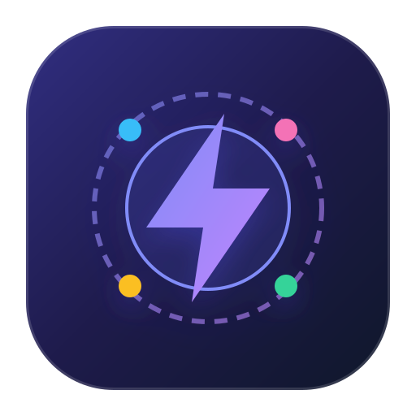
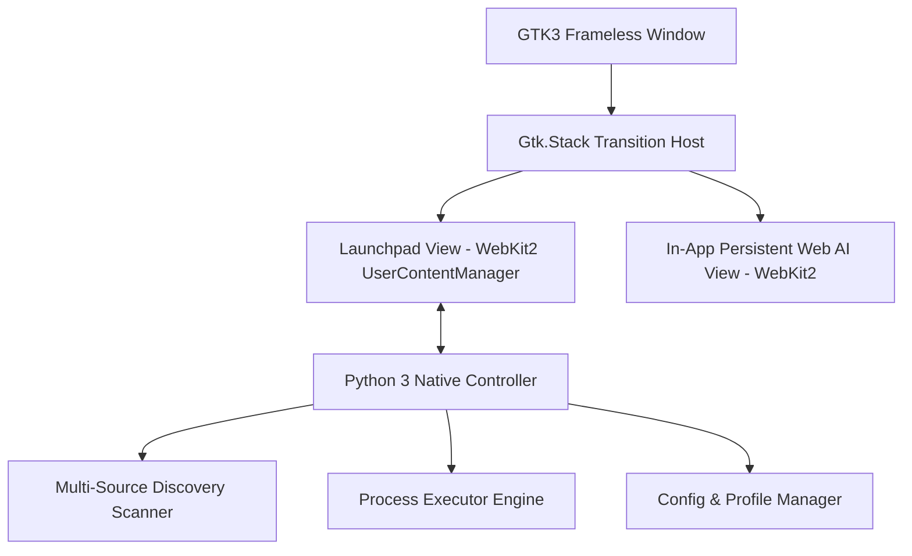

# AswitchI — macOS AI Switcher # AswitchI — macOS AI Switcher & Launchpad for Ubuntu Launchpad for Ubuntu


<div align="center">
  
  <br />
  <strong>By Lorapok Labs</strong> (Founder: Maizied)
  <br /><br />
  <a href="#features"></a>
  <a href="#architecture"></a>
  <a href="#test-suite"></a>
  <a href="#lorapok-labs"></a>
</div>

---

## 🌟 Overview

**AswitchI** is an autonomous native AI Launchpad for Ubuntu Linux developed by **Lorapok Labs**. It bridges Desktop AI IDEs (Cursor, Kiro IDE, Claude Desktop, Devin, Windsurf, Antigravity), CLI AI agents (`agy`, `claude`, `cursor-agent`, `kiro-cli`, `devin`, `aider`), persistent in-app Web AIs (Claude, ChatGPT, Gemini, Perplexity, DeepSeek, v0, Grok), and 53+ local workspace repositories into a unified, fluid macOS Launchpad interface.

---

## ✨ Features

- 🍎 **Authentic macOS Launchpad & 3D Glass Dock**: Frosted glass reflections, Apple SF Pro typography, and multi-stage elastic bounce physics on launch.
- 🚀 **Zero-Login In-App Web AIs**: Web AIs run directly inside AswitchI with encrypted SQLite cookie and session persistence (`~/.config/aswitchi/webai-profile`).
- ⚡ **Strict 7-Column Grid Containment**: Exactly 14 items per page (2 rows × 7 columns) centered with safe side margins to eliminate edge clipping.
- 🟢 **100% Precise Process Tracking**: Line-by-line regex token matcher with exclusion filters for browser extensions and background helpers (zero false positive dots).
- 🏷️ **Frosted Glass Type Badges**: Distinguishes Web AIs (`🌐`), CLI Agents (`>_`), Desktop IDEs (`⌘`), and Workspace Projects (`📁`).
- 📂 **Workspace Project Picker**: Right-click any IDE to open directly into indexed projects across `~/Shohoz`, `~/Desktop`, or `/mnt/NewVolume/Personal_Projects`.
- 📌 **Persistent Dock Pinning**: Right-click any tool to pin or unpin from the 3D Dock.
- ⌨️ **Trackpad Gestures & Shortcuts**: 2-finger horizontal swipe for page navigation, `Esc` to return, and `Enter` for instant search execution.
- 🏢 **Lorapok Labs Info & Help Modal**: Click the floating `?` icon to view complete user instructions and developer background.

---

## 🚀 Quick Start

Launch **AswitchI** from anywhere:
```bash
aswitchi
```
Or use CLI arguments:
```bash
aswitchi --list     # Print all detected tools and running statuses
aswitchi --sync     # Perform an immediate system scan and refresh
```

---

## 🏗️ Architecture

See [`docs/ARCHITECTURE.md`](docs/ARCHITECTURE.md) for the full architectural breakdown.



---

## 🧪 Test Suite

Run the comprehensive 26-test suite:
```bash
python3 /mnt/NewVolume/Personal_Projects/AswitchI/tests/run_all_tests.py
```

---

## 🏢 About Lorapok Labs

* **Organization**: Lorapok Labs
* **Founder & Lead Architect**: Maizied
* **Mission**: Building next-generation AI orchestration tools, autonomous coding architectures, and native developer experiences.
* **Documentation**: See [`docs/`](docs/) directory for detailed guides.
